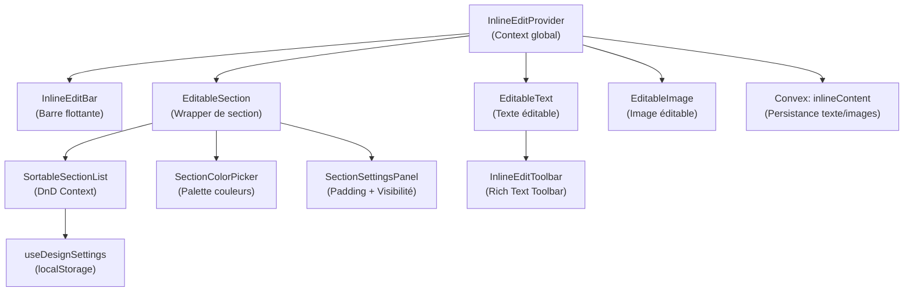
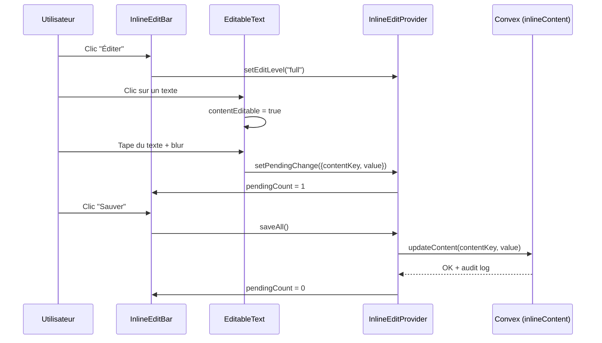

# 📝 Recap — Mode Édition Direct (Inline Edit)

## Vue d'ensemble

Le mode édition direct permet aux administrateurs de modifier le contenu du site **en temps réel**, directement sur les pages publiques, sans passer par un back-office séparé. Le système est organisé en **5 niveaux d'édition** et composé de **11 fichiers** dans `src/components/inline-edit/`.

---

## Architecture

---

## Les 5 Niveaux d'Édition

| Niveau | Icône | Description | Ce qui devient éditable |
|--------|-------|-------------|------------------------|
| `off` | — | Mode lecture normal | Rien |
| `design` | 🎨 | Layout et design | Sections, DnD, couleurs, padding, visibilité |
| `content` | ✏️ | Contenu texte | Textes, titres, paragraphes (contentEditable) |
| `images` | 🖼 | Images | Remplacement d'images par URL |
| `full` | ✨ | Tout activé | Tous les niveaux simultanément |

Défini dans [InlineEditProvider.tsx](file:///Users/okatech/okatech-projects/france.consulat.ga/src/components/inline-edit/InlineEditProvider.tsx) via le type `EditLevel`. Le niveau est persisté dans `localStorage` (`inline_edit_level`).

---

## Composants — Détail

### 1. InlineEditProvider (Context)

[InlineEditProvider.tsx](file:///Users/okatech/okatech-projects/france.consulat.ga/src/components/inline-edit/InlineEditProvider.tsx) — 202 lignes

Le **cœur** du système. React Context qui fournit :

- `editLevel` / `setEditLevel` — Le niveau d'édition actif
- `canEditDesign` / `canEditContent` / `canEditImages` — Permissions par niveau
- `pendingChanges` — Modifications en attente (pas encore sauvegardées)
- `saveAll()` — Sauvegarde toutes les modifications vers **Convex** via `inlineContent.updateContent`

### 2. InlineEditBar (Barre flottante)

[InlineEditBar.tsx](file:///Users/okatech/okatech-projects/france.consulat.ga/src/components/inline-edit/InlineEditBar.tsx) — 166 lignes

Barre fixée en bas de l'écran qui permet de :
- Basculer entre les 4 niveaux d'édition (Design / Texte / Images / Tout)
- Voir le nombre de modifications en attente
- **Sauver** ou **Quitter** le mode édition
- Affiche un badge coloré selon le niveau actif

### 3. EditableSection (Wrapper de section)

[EditableSection.tsx](file:///Users/okatech/okatech-projects/france.consulat.ga/src/components/inline-edit/EditableSection.tsx) — 183 lignes

Enveloppe une section de page pour la rendre interactive en mode Design :
- **Drag handle** (⠿) via `@dnd-kit/sortable` → réorganiser les sections
- **Color picker** (🎨) → changer la couleur de fond
- **Settings** (⚙️) → padding + visibilité
- Bordure violette en pointillés au survol + badge avec le nom de la section
- Section masquée affichée en rouge avec bouton "Afficher"

### 4. EditableText (Texte éditable)

[EditableText.tsx](file:///Users/okatech/okatech-projects/france.consulat.ga/src/components/inline-edit/EditableText.tsx) — 171 lignes

Rend tout texte éditable en mode `content` :
- Icône crayon (✏️) + bordure pointillée primaire au survol
- Click → mode `contentEditable` avec outline bleu
- Blur → enregistre la modification en `pendingChanges`
- Escape → annule les modifications
- Ouvre le `InlineEditToolbar` pour le formatage riche

### 5. InlineEditToolbar (Rich Text)

[InlineEditToolbar.tsx](file:///Users/okatech/okatech-projects/france.consulat.ga/src/components/inline-edit/InlineEditToolbar.tsx) — 582 lignes

Barre d'outils complète de formatage texte, ancrée au-dessus du champ en édition :

| Outil | Description |
|-------|-------------|
| **Gras** (B) | `document.execCommand("bold")` |
| **Italique** (I) | `document.execCommand("italic")` |
| **Souligné** (U) | `document.execCommand("underline")` |
| **Taille** | 10 tailles de 12px à 48px |
| **Couleur** | 17 couleurs prédéfinies |
| **Styles** | 5 presets de gradient (Bleu, Vert, Or, Rouge, Normal) |
| **Reset** | Remettre le texte par défaut |

### 6. EditableImage (Image éditable)

[EditableImage.tsx](file:///Users/okatech/okatech-projects/france.consulat.ga/src/components/inline-edit/EditableImage.tsx) — 87 lignes

En mode `images` :
- Badge "Image" vert en haut à droite
- Overlay "Changer l'image" au survol
- Click → `window.prompt()` pour saisir une nouvelle URL
- Bordure émeraude en pointillés

### 7. SortableSectionList (DnD Container)

[SortableSectionList.tsx](file:///Users/okatech/okatech-projects/france.consulat.ga/src/components/inline-edit/SortableSectionList.tsx) — 134 lignes

Wrapper `DndContext` + `SortableContext` de `@dnd-kit` :
- Réordonne les `EditableSection` enfants par drag-and-drop
- Utilise `PointerSensor` (distance: 8px) + `KeyboardSensor`
- Clone les enfants avec les styles/callbacks injectés
- En mode non-design, rend simplement les enfants dans l'ordre sauvegardé

### 8. useDesignSettings (État design)

[useDesignSettings.ts](file:///Users/okatech/okatech-projects/france.consulat.ga/src/components/inline-edit/useDesignSettings.ts) — 154 lignes

Hook qui gère la persistance **localStorage** du design par page :

| Propriété | Type | Description |
|-----------|------|-------------|
| `sectionOrder` | `string[]` | Ordre des sections |
| `sectionStyles` | `Record<id, SectionStyle>` | Styles par section |

Chaque `SectionStyle` contient :
- `bgColor: string` — couleur de fond hex
- `padding: "compact" | "normal" | "spacious" | "xl"` — espacement
- `hidden: boolean` — masquer/afficher

### 9. SectionColorPicker

[SectionColorPicker.tsx](file:///Users/okatech/okatech-projects/france.consulat.ga/src/components/inline-edit/SectionColorPicker.tsx) — 116 lignes

Popover palette avec **16 couleurs prédéfinies** (transparent, blanc, gris, bleu, indigo, violet, émeraude, ambre, rose, rouge, sombre, noir) + **input custom hex**.

### 10. SectionSettingsPanel

[SectionSettingsPanel.tsx](file:///Users/okatech/okatech-projects/france.consulat.ga/src/components/inline-edit/SectionSettingsPanel.tsx) — 98 lignes

Popover paramètres avec :
- **Padding** : 4 niveaux (Compact / Normal / Spacieux / Très spacieux)
- **Visibilité** : toggle masquer/afficher la section
- **Reset** : remettre les valeurs par défaut

---

## Backend Convex

### Table `editableContent`

[inlineContent.ts](file:///Users/okatech/okatech-projects/france.consulat.ga/convex/functions/inlineContent.ts) — 138 lignes

| Fonction | Description | Protection |
|----------|-------------|------------|
| `getPageContent` | Charger tous les blocs d'une page | Public (query) |
| `getContent` | Charger un bloc par `contentKey` | Public (query) |
| `updateContent` | Créer ou mettre à jour un bloc | `moduleMutation("inline_edit")` |
| `resetContent` | Remettre un bloc à sa valeur par défaut | `moduleMutation("inline_edit")` |

Chaque modification est **auditée** via `logAudit()` avec l'ID utilisateur et horodatage.

---

## Flux de données

---

## Dépendances installées

| Package | Usage |
|---------|-------|
| `@dnd-kit/core` | DnD context et sensors |
| `@dnd-kit/sortable` | Sections sortables |
| `@dnd-kit/utilities` | CSS Transform helpers |

---

## Pages intégrées

Actuellement, les pages suivantes sont wrappées avec `SortableSectionList` et utilisent `EditableSection` :

- [le-consulat.tsx](file:///Users/okatech/okatech-projects/france.consulat.ga/src/routes/le-consulat.tsx)
- [actualites/index.tsx](file:///Users/okatech/okatech-projects/france.consulat.ga/src/routes/actualites/index.tsx)
  - Sections configurées : `hero`, `filters`, `content`, `cta`, `citizen-cta`

---

## État actuel et points d'attention

### ✅ Implémenté
- 5 niveaux d'édition avec sélecteur dans la barre flottante
- Édition de texte inline avec rich text toolbar complet
- Édition d'images par URL
- Drag-and-drop des sections
- Color picker (16 couleurs + custom)
- Panneau settings (padding 4 niveaux + visibilité)
- Persistance texte/images → Convex avec audit
- Persistance design (ordre, styles) → localStorage
- Protection module `inline_edit` sur les mutations

### ⚠️ Points d'évolution possibles
- **Migration localStorage → Convex** : Les settings de design sont en localStorage, une table `sectionDesign` dédiée permettrait la persistance multi-utilisateur
- **Upload d'images** : Actuellement par URL manuelle (`window.prompt`), un upload vers Convex Storage serait plus UX
- **Extension à d'autres pages** : Le pattern est en place sur `/le-consulat` et `/actualites`, les autres pages peuvent adopter le même pattern progressivement
